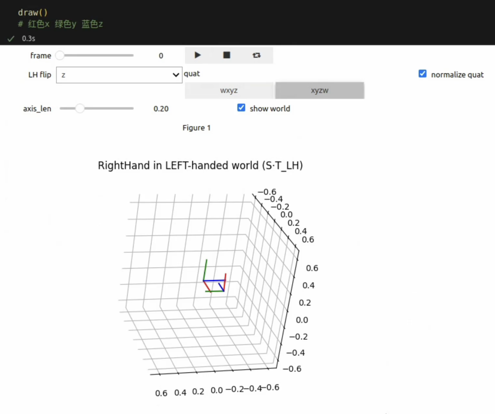

# 介绍
坐标系可视化

# 文件功能
tf_left_right.ipynb 可拖动变化的左右手坐标系

read_left_origin_data.ipynb 借助hdf5的左手坐标系变化演示

read_left2right_data.ipynb 左手坐标系转右手转右手坐标系演示

read_right_tf_data.ipynb 初始坐标系绕y轴旋转90度

read_right_delta_data.ipynb 相对第一帧位姿变化



# 安装需求
``` bash
pip install notebook
pip install pytransform3d matplotlib ipywidgets ipympl
```